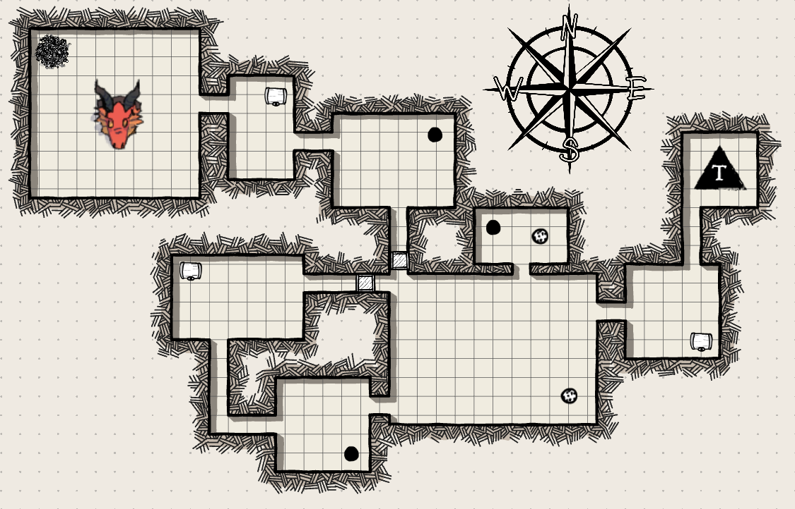

# Calgwin Origins: Solo

Calgwin Origins: Solo is a text based dungeon crawler game made in BlueJ for King's College London's 4CCS1PPA Module Coursework, developed by Waseef Khan.

Here, you have to use the command-line to traverse through unknown rooms and find the exit to escape the dungeon. You may meet NPCs, obtain items and/or battle against monsters!

## Synopsis

You are Ray, a warrior locked into an unknown dungeon in the vast world of Calgwin by a cruel tyrant. You need to find your way out and just before you got thrown into this labyrinth, you were told by someone that there is another exit to this dungeon, but it is guarded by this entity named “Zuul”. Your job is to defeat this entity and escape from the dungeon.

## Implementation

This program has a few important features

- A very basic battle system, where you can fight against enemies and/or use items.
- You can talk with NPCs (Non playable characters). Some of them let you choose from dialogue options, the correct choice may reward you!
- There are items in some rooms that can be picked up (there are some that can’t be picked up too!). You can pick them up, use them or discard them (i.e. drop them inside the room you’re currently in)
- There is a weird room in this dungeon that randomly teleports you to another room!
- There is a final boss that you must beat to win the game!

## World Map

